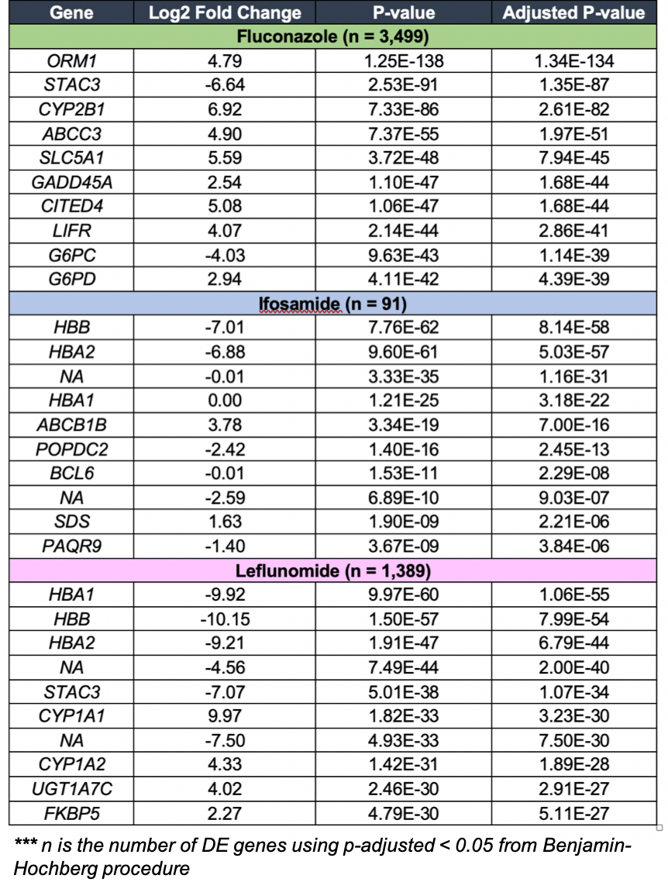

# Introduction

This repository is built to study the concordance of differential gene expression between microarray and RNA-seq data based on the original publication, <em>A comprehensive study design reveals treatment- and transcript abundance–dependent concordance between RNA-seq and microarray data by Wang et al. (2014)</em>. The goal of this project was to reproduce the concordance comparison between two platforms using 3 of the toxicological treatments, including assessing how they differently performed on chemicals treatment effect, below-median expressed genes, and pathway enrichment.

# Samples

We were given an option to pick a toxgroup to analyze. Our team selected toxgroup 3 to study the concordance of differential gene expression between microarray and RNA-seq data. There were 15 samples in the toxgroup: 3 treatment conditions (Fluconazole, Ifosamide, and Leflunomide) and two vehicle controls (Corn Oil 100% and Saline 100%).

# Methods

STAR was utilized to perform the sequence alignment as it has specialty in doing spliced alignment for RNA-seq data. To investigate how genes are differentially expressed, DESeq2 as a good bioconductor package using negative binomial regression was used to estimate the count differences between treatment and control groups. To further identify which pathways show enrichment, differentially expressed genes (DEGs) obtained from DESeq2 were analyzed by GATHER, a gene annotation tool that could help identify related KEGG pathways.

# Findings

## <em>RNA-seq</em>

In this study, DESeq2, a Bioconductor package is used to estimate the count differences between a given treatment and an appropriate control group. <b>Table 1</b> shows the top 10 differentially expressed genes (DEGs) between a given treatment and an appropriate control that have the same vehicle control. The number of DEGs were reported at p-adjusted < 0.05 using Benjamin-Hochberg correction. A histogram in <b>Figure 1A,C,E</b> and a volcano plot in <b>Figure 1B,D,F</b> also show the distribution of log2 fold change values and the log2 fold change versus normal-p value for the significant DE genes, respectively. Based on the volcano plots for each chemical group, we observed that there are more DEGs in Fluconazole and Leflunomide as compare to Ifosamide. These findings indicate toxic groups of AhR and CAR/PXR which associate with Fluconazole and Leflunomide respectively, are more likely expressed in Rat gene expression as a way to treat and prevent fungal infections and rheumatoid arthritis as opposed to Ifosamide which use to treat cancer of the testicles

</img>

<b>Table 1</b>. Top 10 Differentially Expressed Genes by Chemical

</img>

<b>Figure 1</b>. Volcano plots and histograms of the differentially expressed genes for three treatment conditions (Fluconazole, Ifosamide, and Leflunomide)

## <em>Microarray</em>

A total number of 1997 genes were found to be differentially expressed with fluconazole treatment at an adjusted p value of <0.05. The volcano plot (<b>Figure 2A</b>) and histogram (<b>Figure 2B</b>) of the differentially expressed genes for fluconazole showed a normal distribution of differentially expressed genes spread on either side of 0. In contrast, many of the genes differentially expressed with Ifosamide treatment had large adjusted p-values (<b>Figure 3</b>) with none of the genes reaching the adjusted p value threshold of <0.05 of significance. For leflunomide, 466 genes were differentially expressed with an adjusted p value of <0.05. The differentially expressed genes for leflunomide were relatively normally distributed around a log fold change of 0, although several genes had high fold changes but did not meet statistical significance based upon an adjusted p value <0.05 (<b>Figure 4</b>). 

</img>

<b>Figure 2</b>. Volcano plot (A) and histogram (B) of the differentially expressed genes with Fluconazole treatment. 

</img>

<b>Figure 3</b>. Volcano plot of the differentially expressed genes with Ifosamide treatment. 

</img>

<b>Figure 4</b>. Volcano plot (A) and histogram (B) of the differentially expressed genes with Leflunomide treatment.

In order to better understand the genes that were differentially expressed between each treatment and the controls, we further evaluated the top 10 differentially expressed genes (<b>Table 2</b>). We further evaluated the concordance between the array and sequencing platforms for the Ifosfamide, Fluconazole, and Leflunomide chemical treatments (<b>Figures 5 and 6</b>). We found that for leflunomide, the concordance in DEGs between the platforms was -23.7%. For Ifosfamide, the concordance was approximately 55.2% whereas for Fluconazole, the concordance was 32.1%.  In order to determine whether the concordance between the microarray and RNA-seq platforms was similar for DEGs in high and low abundance, we compared the overall concordance to the DEGs below and above the median for the three chemicals (<b>Figure 7</b>). We found that the low abundance DEGs (below the median) had a lower concordance compared to the DEGs above the median.  

</img>

<b>Table 2</b>. Top 10 Differentially Expressed Genes by Chemical

</img>

<b>Figure 5</b>. Comparison of the number of DEGs identified by Microarray

</img>

<b>Figure 6</b>. Comparison of the number of DEGs identified by RNA-Seq

</img>

<b>Figure 7</b>. Concordance between Microarray and RNA-Seq

Top 10 expressed genes obtained from previous results for each chemical treatment were used to determine which pathways were enriched. GATHER was utilized to complete such jobs as it is convenient and fast at identifying KEGG pathways. Results from GATHER for each chemical were compared with the listed common pathways enriched for each of the MOA chemical groups from the supplementary materials by Wang et al (<b>Table 3</b>). Fluconazole was included as a chemical in the MOA of orphan nuclear hormone receptors (CAR/PXR), ifosfamide was included in DNA damage, and Leflunomide was included in aryl hydrocarbon receptor (AhR).

Comparing the pathway enrichment results for each chemical obtained from this study to the common pathway enrichment for corresponding MOA chemical group in general, only the pathway of glutathione metabolism is mostly consistent to the listed common pathway enrichment of glutathione-mediated detoxification (<b>Table 3</b>). Other pathways cannot be considered as consistent between two lists. Lastly, normalized expression matrices are used to create heatmaps for each chemical treatment (<b>Figure 8</b>). 

</img>

<b>Table 3</b>. Pathway Enrichment with top 10 expressed genes for each chemical treatment analyzed by GATHER

</img>

</img>

<b>Figure 8</b>. Clustered heatmap of the counts. (A) Comparing fluconazole as chemical treatment to corn oil as control. (B) Comparing fluconazole as chemical treatment to saline as control. (C) Comparing leflunomide as chemical treatment to corn oil as control. 

# Discussion and Conclusion

By utilizing DESeq2, top 10 differentially expressed genes for each 3 chemicals - fluconazole, ifosfamide, and leflunomide were able to be identified and listed separately for microarry and RNA-seq data. After analyzing DEGs from both platforms, concordance of the significant DEGs detected by microarray and RNA-Seq is calculated for each chemical treatment. Results show that in general, the concordance in DEGs between platforms is not relatively high, with -23.7%, 55.2%, and 32.1% for each chemical respectively. And the pathway enrichment identified by GATHER with top 10 DEGs for each chemical treatment did not show good consistency with common pathway enrichment for their corresponding MOA chemical groups.

Our results suggest that the two platforms do not concordant with each other well. In general they showed low concordance scores, and the concordance also depends on DEGs abundance - the low abundance DEGs had a lower concordance compared to the DEGs above the median. This is consistent with some former study that suggested microarray and RNA-seq perform differently on the precision of low abundance gene detection. 

Overall, this study is consistent with the original paper on the concordance dependency of treatment effect between RNA-Seq and microarrays, but did not successfully reproduce the same pathway enrichment and clustered heatmap. 

One challenge is making clustered heatmaps for all the DEGs from the normalized matrix, and trying to make it consistent with each MOA group. The needed information is which sample represented what kind of treatment or control, and how could the matrix be changed and filtered so that it could show desired clustering but meanwhile it is still objectively scientific? 

# References

1.	Wang C, et al. A comprehensive study design reveals treatment- and transcript abundance-dependent concordance between RNA-seq and microarray data. Nat Biotechnol. 2014 Sep; 32(9): 926-932

# Resources

### Code

<b>Snakefile</b> is a file that used to create a workflow that do the sequencing alignment with STAR alignment tool. It was also used to generate count data with featureCounts program. Lastly, it was used to run Multiqc to create an alignment report for all samples. The file is located at <b>/projectnb/bf528/users/wheeler/project_3</b>

<b>project_3_programmer.R</b> is an R script that runs all the analysis for Programmer part (such as differential expression analysis using DESeq2 package for RNA-seq data). It is stored at <b>/projectnb/bf528/users/wheeler/project_3</b>

<b>concordance.calc.R</b> (located at <b>/projectnb/bf528/users/wheeler/project_3</b>)

This R script was created using R version 4.0.2 and calculates the concordance for differentially expressed genes (DEGs) identified by microarray and RNA-seq. The script maps the ProbeIDs for the microarray to Refseq identifiers in order to identify the overlap between the microarray and RNA-seq datasets. The probabilities for observing the number of DEGs in each dataset is calculated and the concordance between the microarray and RNA-seq datasets is calculated both with and without accounting for the DEGs identified by chance

<b>limma_group3.R</b> (located at <b>/projectnb/bf528/users/wheeler/project_3</b>)

This R script created in R v4.0.2 utilizes limma, a Bioconductor package, to calculate the differential expression of 3 chemical treatments (leflunomide, fluconazole, ifosamide) compared to the control with the appropriate vehicle (saline or  corn oil). Rma normalized data serves as the input and the outputs are csv files of the differential expression, one for each treatment. 

<b>biologist.R</b> is an R script that runs all the analysis for Biologist part (such pathway enrichments and heatmaps). It is stored at <b>/projectnb/bf528/users/wheeler/project_3/Biologist</b>

### Output 

9 bam files containing alignments for each of your samples are stored in <b>/projectnb/bf528/users/wheeler/project_3/samples</b> directory

9 counts files containing gene counts for each sample are also stored in <b>/projectnb/bf528/users/wheeler/project_3/samples</b> directory

<b>multiqc_report.html</b> gives summary tables and plots for relevant features of the counts data obtained from multiqc. It is currently stored at <b>/projectnb/bf528/users/wheeler/project_3</b>

# Contributors

<strong>Curator:</strong> Reina Chau (RC-88)  
<strong>Programmer:</strong> Vishala Mishra  
<strong>Analyst:</strong> Jessica Fetterman (jessicalfetterman)  
<strong>Biologist:</strong> Ariel Xue (arial208x)  

  

